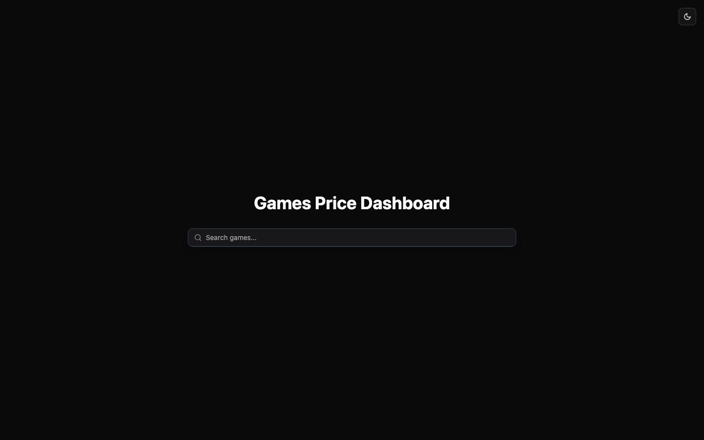
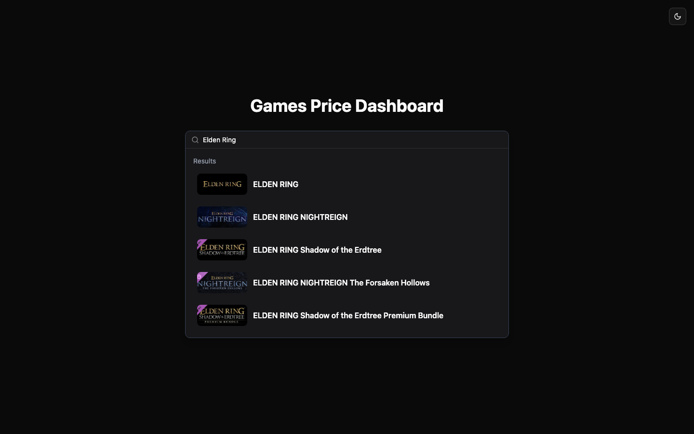

# Games Price Dashboard — Frontend

React + TypeScript dashboard for tracking Steam game prices: search any game, view its price history on a custom **D3 chart** with tooltips, see store lows, and get an AI-predicted next discount.

**🔗 Live: [games-stats.vercel.app](https://games-stats.vercel.app/)** · Backend: [steamPriceBackend](https://github.com/faisal-almugesib/steamPriceBackend)

> ⚠️ The free-tier backend hosting (Railway) has expired, so search on the live site is currently offline — run the stack locally with the steps below. The UI itself is fully deployed.

## Preview

| Home | Search |
|---|---|
|  |  |

## Features

- **Command-palette search** (cmdk + shadcn/ui) hitting the Steam Store API through the backend
- **Price history chart** built from scratch with D3: multi-store series, hover tooltips, lowest-price marker
- **Discount prediction** card — Gemini-generated estimate of the next sale date/price with confidence
- **Dark/light mode** with a theme provider

## Stack

React 18 · TypeScript · Vite · Tailwind CSS · shadcn/ui · D3 v7

## Run Locally

```bash
# 1. Start the backend (see steamPriceBackend README)
# 2. Then:
npm install
VITE_BACKEND_URL=http://127.0.0.1:8000 npm run dev   # http://localhost:5173
```
